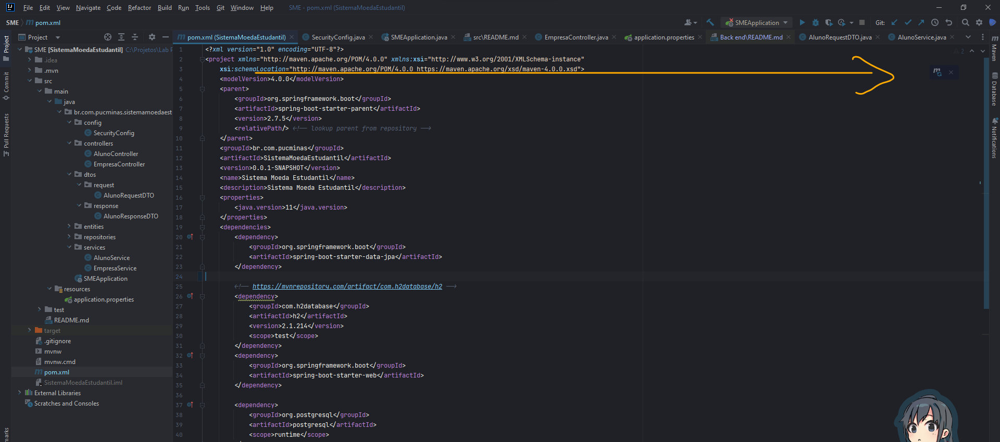
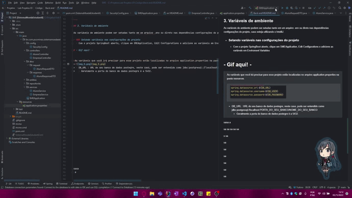
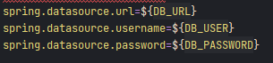

# Instruções gerais para rodar o projeto localmente
___

## Sumário
1. Instalação da IDE
2. Abrindo o projeto
3. Configurando as varíaves de ambiente
4. Rodando o projeto
5. Endpoints da aplicação

___

> Antes de tudo, verifique se ao menos a versão 11 da JDK está instalada.

## 1. Instalação da IDE

### IntelliJ
 Para fazer o download da IDE da Jet Brains, entre no [site oficial](https://www.jetbrains.com/pt-br/idea/download/) e 
 Realize o download conforme seu sistema operacional.
 
- ### IntelliJ IDEA Community 
  - Versão gratuita do intelliJ, proporciona o básico da experiência, com suporte as linguágens Java, Kotlin, Groovy e Scala, possui integração com mo docker, depurador próprio e integração autimatizada também com repositórios GIT.

- ### IntelliJ  IDEA Ultimate:
  - Recomendado para tudo, com clientes dedicados, suporte a inúmeros frameworks, bancos de dados, desenvolvimento colaborativo além de tudo que o Community já proporciona.

> - Recomendo fortemente, claro, a versão ultimate uma vez que possui maiores benefícios e flexibilidade ao desenvolver projetos maiores.
> Além de tudo, a licença ultimate está disponível para estudantes portanto, vamos seguir com o download partindo desta versão.

jdbc:postgresql://localhost:5432/Lab03

Mais informações sobre as licenças gratuítas e para quem elas se aplicam podem ser visualizadas [aqui](https://www.jetbrains.com/community/education/#students/faq).

Após a instalação e aplicação da possível licença recebida na ID, é hora de abrir o projeto.

## 2. Abrindo o projeto

com a IDE já aberta e o repositório do projeto já no computador o processo se torna simples, caso a tela de seleção de projeto não abra automaticamente,
basta ir até File, Open e selecionar a pasta do projeto.
 

___

Com o projeto aberto, basta, agora baixar as dependências do maven, que se encontram no arquivo pom.xml, logo na raiz do projeto.
Ao abrir o arquivo, as dependências irão ser baixadas automaticamente, e podem ser acompanhadas na parte inferior da aplicação.

> Caso o download de dependências não inicie automaticamente, ao abrir o arquivo pom.xml, um ícone do maven deve aparecer no canto superior esquerdo (conforme a imagem)
>. Ao clicar, o carregamento das dependências irá iniciar.

___

## 3. Variáveis de ambiente

As variáveis de ambiente podem ser setadas tanto em um arquivo .env ou direto nas dependências configurações do projeto, caso esteja utilizando o IntelliJ.

- ### Setando variáveis nas configurações do projeto 
  - Com o projeto SpringBoot aberto, clique em SMEApplication, Edit Configurations e adicione as variáveis em Enviroment Variables

>As variáveis que você irá precisar para esse projeto estão localizadas no arquivo application.properties na pasta resources.
>>
> - DB_URL: URL do seu banco de dados postegre, neste caso, pode ser entendido como jdbc:postgresql://localhost:PORTA_DO_SEU_BANCO/NOME_DO_SEU_BANCO
>   - Geralmente a porta do banco de dados postegre é a 5432.
> - DB_USER: Usuário do postgre, geralmente o padrão é "postgres"
> - DB_PASSWORD: Senha do banco de dados.

___
## 4. Rodando o projeto

Para rodar o projeto, basta clicar em RUN ao lado de SMEApplication ou clicar com o botão direito na classe principal "SMEApplication" e clicar em Run.

A porta do app está configurada como 3001, portanto irá ser hospedado em "http://localhost:3001/".

___
## 5. Endpoints da aplicação

Endereço local base: http://localhost:3001/api

### 5.0 Login
[POST]

- Endpoint: /login

Exemplo de json:
>{
>   "email": "marco@gmail.com",
>   "senha": "123"
>}

O retorno se da com o mesmo corpo dos métodos de mostrar, dependendo da entidade requisitada.

___

### 5.1 Alunos

- ###### Cadastrar Aluno

Endpoint: /aluno/cadastrar

Exemplo de Json:
>{
> 	"nome": "Pedro",
>   "email":"pedro@gmail.com",
>   "senha": "12332",
>   "rg": "31278378192312",
>   "cpf": "32897137812",
>   "endereco": "sla 123",
>   "saldo": 59.0,
>   "roleID": 1
>}

- ###### Mostrar aluno por Id

Endpoint: /aluno/mostrar/id/{id}

Exemplo de Json de retorno:

>{
>   "id": 2,
>   "nome": "Pedro",
>   "email": "pedro123@gmail.com",
>   "rg": "31278378192312",
>   "endereco": "sla 123",
>   "saldo": 5649.1,
>   "roleID": 1,
>   "cpf": "32897137812",
>   "compras": [
>     {
>       "id": 1,
>       "vantagens": [
>         {
>           "id": 1,
>           "descricao": "Shulambs",
>           "valor": 150.1,
>           "imagem": "png"
>         },
>         {
>           "id": 2,
>           "descricao": "Shulambs",
>           "valor": 150.1,
>           "imagem": "png"
>         }
>       ],
>       "valor": 300.2
>      },
>     {
>        "id": 3,
>       "vantagens": [
>         {
>           "id": 3,
>           "descricao": "Shulambs",
>           "valor": 150.1,
>           "imagem": "png"
>          }
>        ],
>       "valor": 150.1
>      }
>    ]
>  }
>}
 
- ###### Listar todos os alunos cadastrados

Endpoint: /aluno/listar

Exemplo de Json de retorno:

>[
>   {
>       "id": 1,
>       "nome": "Pedro",
>       "email": "pedro@gmail.com",
>       "rg": "31278378192312",
>       "endereco": "sla 123",
>       "saldo": 61.0,
>       "cpf": "32897137812",
>       "roleID": 1
>   }
>]

- ###### Deletar Aluno por Id

Endpoint: /aluno/deletar/id/{id}

(ta meio bugado ainda)
___

### 5.2 Professores

- ###### Cadastrar Professor

Endpoint: /professor/cadastrar

Exemplo de Json:

>{
>   "nome":"Marco",
>   "email": "marco@gmail.com",
>   "moedas": 59.0,
>   "cpf": "36123612-31",
>   "senha":"123,
>   "roleID": 2
>}

- ###### Mostrar Professor por Id

Endpoint: /professor/mostrar/id/{id}

Exemplo de Json de retorno:

>{
>   "id": 1,
>   "nome": "Marco",
>   "email": "marco@gmail.com",
>   "moedas": 59.0,
>   "cpf": "36123612-31",
>   "roleID": 2
>}

- ###### Listar todos os Professores cadastrados

Endpoint: /professor/listar

Exemplo de Json de retorno:

>[
>   {
>       "id": 1,
>       "nome": "Marco",
>       "email": "marco@gmail.com",
>       "moedas": 4.0,
>       "cpf": "36123612-31",
>       "roleID": 2
>   }
>]

- ###### Deletar Professor por Id

Endpoint: /empresa/deletar/id/{id}

___

### 5.3 Empresas

- ###### Cadastrar Empresas

    Endpoint: /empresa/cadastrar
 
 
    Exemplo de Json:
>{
>   "nome":"Marco ltda",
>   "email": "marcoltda@gmail.com",
>   "cnpj": "38213879",
>   "saldo": 139082812
>}

- ###### Mostrar Empresa por Id

Endpoint: /empresa/mostrar/id/{id}

Exemplo de Json de retorno:

>{
>   "id": 1,
>   "nome":"Marco",
>   "email": "marco@gmail.com",
>   "cnpj": "38213879",
>   "saldo": 139082812,
>   "roleID": 3
>}

- ###### Listar todas as empresas cadastradas

Endpoint: /empresa/listar

Exemplo de Json de retorno:

>[
>   {
>       "id": 1,
>       "nome":"Marco",
>       "email": "marco@gmail.com",
>       "cnpj": "38213879",
>       "saldo": 139082812,
>       "roleID": 3
>   },
> ]

- ###### Deletar empresa por Id

Endpoint: /empresa/deletar/id/{id}

___

### 5.4 Transacoes

- ###### Realizar uma transação de um professor para um aluno

Endpoint: /transacao/cadastrar/byprofessor

Exemplo de Json:
>{
>   "alunoId": 1,
>   "professorId": "1",
>   "valor": 30
>   "descricao:" "Bom rendimento!"
> }

- ###### Buscar todas as transações referente ao aluno

Endpoint: /transacao/listar/aluno?id={id}

Exemplo de Json de retorno:

>[
>   {
>       "id": 1,
>       "idAluno": 1,
>       "nomeAluno": "Pedro",
>       "idProfessor": 1,
>       "nomeProfessor": "Marco",
>       "valor": 5.0,
>       "de": "Professor",
>       "para": "Aluno",
>       "descricao": "Bom rendimento!"
>   }
>]

- ###### Buscar todas as transações referente ao professor

Endpoint: /transacao/listar/professor?id={id}

Exemplo de Json de retorno:

>[
>   {
>       "id": 1,
>       "idAluno": 1,
>       "nomeAluno": "Pedro",
>       "idProfessor": 1,
>       "nomeProfessor": "Marco",
>       "valor": 5.0,
>       "de": "Professor",
>       "para": "Aluno",
>       "descricao": "Bom rendimento!"
>   }
>]

___

### 5.5 Compras

- ###### Realizar a compra de Vantagem(s)

Endpoint: /compra/cadastrar

Exemplo de Json:

>{
>   "alunoId": 2,
>   "vantagensIds":[1,2,3]
>}
___
